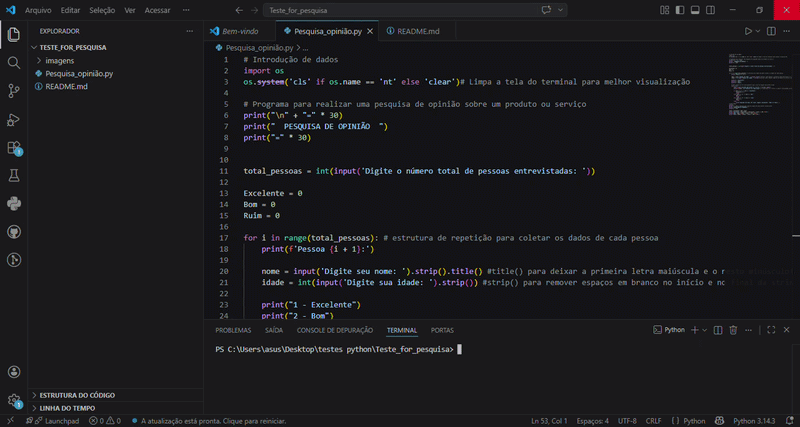
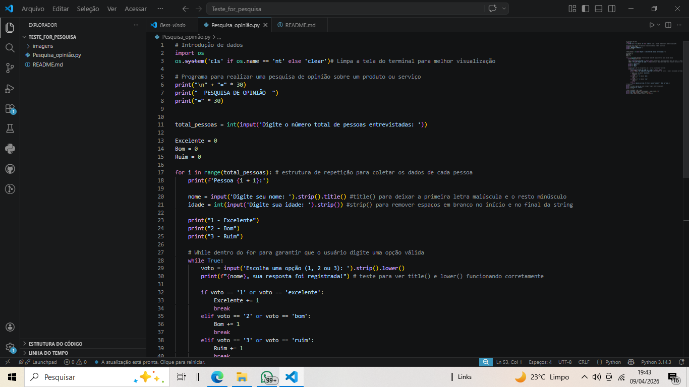
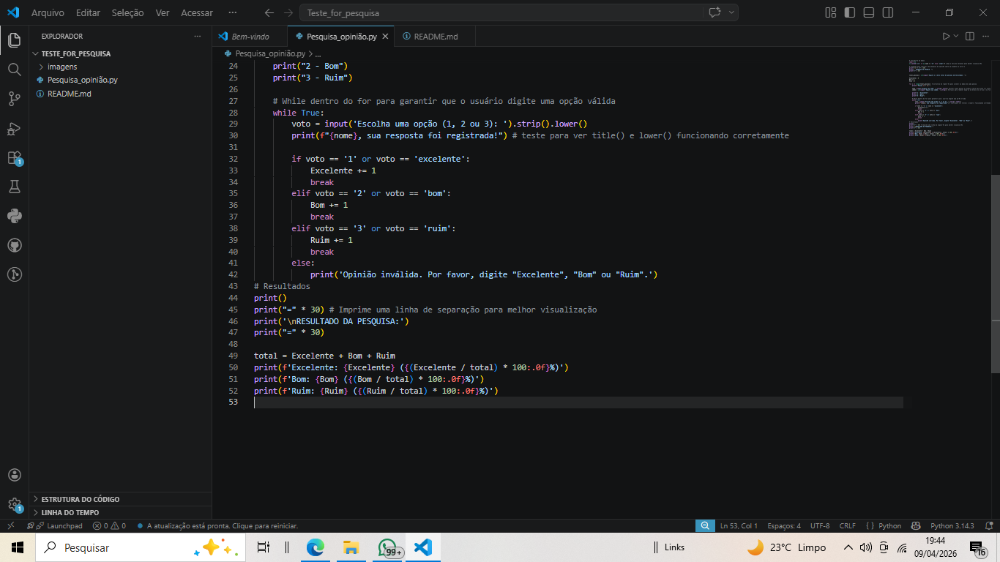
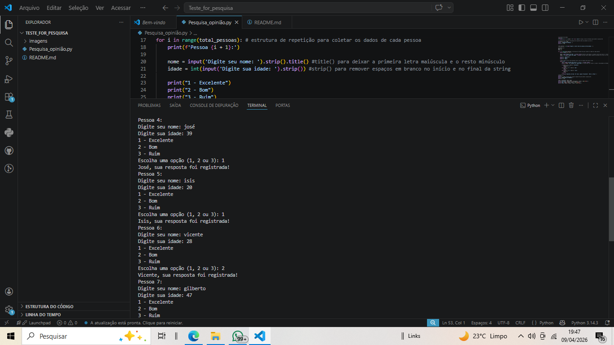
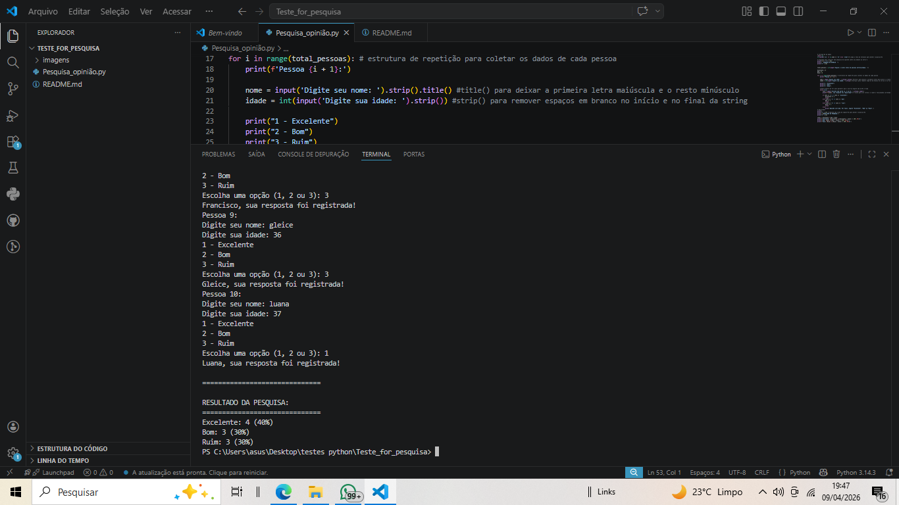

# 📊 Pesquisa de Satisfação em Python


## 📌 Descrição
Este projeto consiste em um programa em Python que realiza uma *pesquisa de opinião*, permitindo coletar dados de usuários e apresentar os resultados de forma organizada.

O sistema registra:
- Nome (com formatação automática)
- Idade (com validação)
- Avaliação (Excelente, Bom ou Ruim)

Ao final, exibe:
- Quantidade de votos
- Porcentagem de cada opção

---

## 🚀 Funcionalidades

✅ Coleta de dados de múltiplos usuários  
✅ Validação de entrada (evita erros)  
✅ Padronização de texto (strip() e lower())  
✅ Formatação de nomes (title())  
✅ Cálculo de porcentagem  
✅ Interface organizada no terminal  

---

## 🧠 Conceitos aplicados

- Estrutura de repetição (for, while)
- Condicionais (if, elif, else)
- Listas e dicionários (opcional)
- Tratamento de erros (try/except)
- Boas práticas de entrada de dados

---

## 💻 Exemplo de execução

```bash
========================================
   PESQUISA DE SATISFAÇÃO
========================================

Pessoa 1
Digite seu nome: Laura
Digite sua idade: 25

Avaliação:
[1] Excelente
[2] Bom
[3] Ruim

Escolha uma opção: 1
Laura, sua resposta foi registrada!

========================================
   RESULTADO DA PESQUISA
========================================
Excelente: 3 (30%)
Bom: 4 (40%)
Ruim: 3 (30%)

---

## 🎥 Demonstração



---

## 📸 Exemplo de execução







---

🛠️ Tecnologias utilizadas
Python 3

---

📈 Possíveis melhorias futuras
Interface gráfica (GUI)
Exportação para arquivo (CSV/Excel)
Dashboard com gráficos
Armazenamento em banco de dados

---

👩‍💻 Autora
Desenvolvido por Laura Santos 💙
